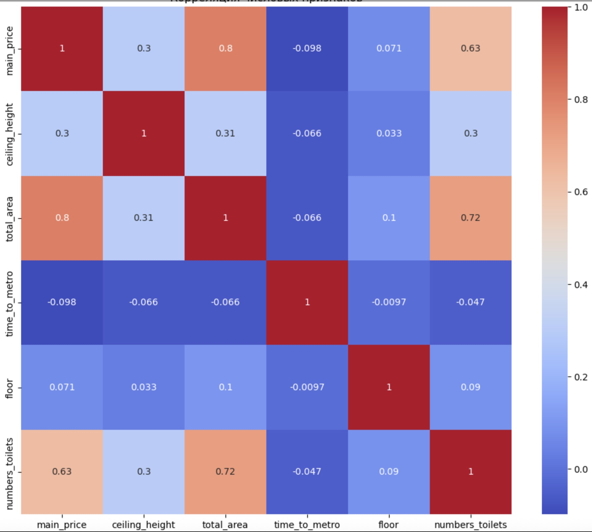

# rent-real-estate
# Оценка стоимости аренды квартир

## Задача

Цель нашего проекта заключается в создании и фильтрации DataFrame, чтобы в будущем создать модель машинного обучения, способной оценивать стоимость аренды квартир, предлагая цену, максимально приближенную к тем, которые выставляют владельцы.

### Технические цели

- Улучшить метрику качества модели MAPE (Mean Absolute Percentage Error) с текущих **50%** до **30%** и менее.
- Метрическая оценка MAPE позволяет наглядно увидеть среднюю абсолютную ошибку в процентах, что особенно удобно для менеджеров и заинтересованных сторон.

## Состав команды

- **Иванов Денис**
- **Галиахметова Динара**
- **Цуркан Станислав**
- **Пампуха Дмитрий**

## Примечания

В процессе работы над проектом проведена очистка данных от выбросов, заполнены, либо удалены пропуски, нормальзованы колонки, выполнена визуализация в целях поиска зависимостей между признаками.

